# ISMS Dashboard Database Schema

## Overview

The ISMS Dashboard uses a Supabase PostgreSQL database with the following key tables and relationships. This schema represents the core data model that supports ISO 27001 compliance management.

```mermaid
erDiagram
    PROJECTS ||--o{ BOUNDARIES : contains
    PROJECTS ||--o{ STAKEHOLDERS : has
    PROJECTS ||--o{ EVIDENCE : stores
    PROJECTS ||--o{ GAPS : identifies
    PROJECTS ||--o{ THREAT_SCENARIOS : analyzes
    PROJECTS ||--o{ PROJECT_QUESTIONNAIRE_ANSWERS : responds_to
    
    BOUNDARIES ||--o{ BOUNDARY_CONTROLS : assigned
    CONTROLS ||--o{ BOUNDARY_CONTROLS : included_in
    
    BOUNDARY_CONTROLS ||--o{ EVIDENCE : documents
    BOUNDARY_CONTROLS ||--o{ GAPS : identifies
    
    CONTROLS ||--o{ EVIDENCE : implements
    CONTROLS ||--o{ GAPS : needs
    
    GAPS ||--o{ REMEDIATION_PLANS : remediated_by
    GAPS ||--o{ RISK_ASSESSMENTS : assessed_as
    GAPS ||--o{ THREAT_SCENARIOS : related_to
    
    RISK_ASSESSMENTS ||--o{ RISK_REMEDIATION_LINKS : linked_to
    REMEDIATION_PLANS ||--o{ RISK_REMEDIATION_LINKS : linked_to
    REMEDIATION_PLANS ||--o{ REMEDIATION_UPDATES : updated_by
    
    QUESTIONNAIRE_QUESTIONS ||--o{ PROJECT_QUESTIONNAIRE_ANSWERS : answered_in
    
    THREAT_SCENARIOS ||--o{ RISK_ASSESSMENTS : evaluates
    BOUNDARIES ||--o{ RISK_ASSESSMENTS : scoped_to

    PROJECTS {
        uuid id PK
        text name
        text description
        timestamp start_date
        timestamp end_date
        uuid user_id FK
        timestamp created_at
        timestamp updated_at
        int status
        timestamp boundaries_completed_at
        timestamp stakeholders_completed_at
        timestamp soa_completed_at
        timestamp evidence_gaps_completed_at
        timestamp objectives_completed_at
        timestamp questionnaire_completed_at
    }
    
    BOUNDARIES {
        uuid id PK
        uuid project_id FK
        text name
        text description
        text type
        boolean included
        text notes
        uuid user_id FK
        timestamp created_at
        timestamp updated_at
        text asset_value_qualitative
        numeric asset_value_quantitative
    }
    
    CONTROLS {
        uuid id PK
        text reference
        text description
        timestamp created_at
        text domain
    }
    
    BOUNDARY_CONTROLS {
        uuid id PK
        uuid boundary_id FK
        uuid control_id FK
        boolean is_applicable
        text reason_inclusion
        text reason_exclusion
        text status
        uuid user_id FK
        timestamp created_at
        timestamp updated_at
        text compliance_status
        timestamp assessment_date
        text assessment_notes
    }
    
    STAKEHOLDERS {
        uuid id PK
        uuid project_id FK
        text name
        text role
        text email
        text responsibilities
        timestamp created_at
        uuid user_id FK
        timestamp updated_at
    }
    
    
    EVIDENCE {
        uuid id PK
        uuid project_id FK
        uuid control_id FK
        text title
        text description
        text file_path
        text file_name
        text file_type
        uuid uploaded_by FK
        timestamp created_at
        timestamp updated_at
        uuid boundary_control_id FK
    }
    
    GAPS {
        uuid id PK
        uuid project_id FK
        uuid control_id FK
        text title
        text description
        text severity
        text status
        uuid identified_by FK
        timestamp identified_at
        timestamp updated_at
        uuid boundary_control_id FK
    }
    
    QUESTIONNAIRE_QUESTIONS {
        uuid id PK
        text iso_domain
        text question_text
        text guidance
        timestamp created_at
        timestamp updated_at
    }
    
    PROJECT_QUESTIONNAIRE_ANSWERS {
        uuid id PK
        uuid project_id FK
        uuid question_id FK
        text answer_status
        text evidence_notes
        uuid answered_by FK
        timestamp answered_at
        timestamp created_at
        timestamp updated_at
    }
    
    THREAT_SCENARIOS {
        uuid id PK
        uuid project_id FK
        text name
        text description
        text threat_actor_type
        text[] relevant_iso_domains
        timestamp created_at
        timestamp updated_at
        uuid gap_id FK
        numeric sle
        numeric aro
        text[] mitre_techniques
    }
    
    RISK_ASSESSMENTS {
        uuid id PK
        uuid project_id FK
        uuid boundary_id FK
        uuid threat_scenario_id FK
        uuid gap_id FK
        uuid control_id FK
        jsonb likelihood_frequency_input
        jsonb loss_magnitude_input
        numeric calculated_risk_value
        text assessment_notes
        timestamp assessment_date
        uuid assessor_id FK
        timestamp created_at
        timestamp updated_at
    }
    
    REMEDIATION_PLANS {
        uuid id PK
        uuid gap_id FK
        text action_item
        text description
        text assigned_to
        date due_date
        text priority
        text status
        uuid created_by FK
        timestamp created_at
        timestamp updated_at
    }
    
    REMEDIATION_UPDATES {
        uuid id PK
        uuid remediation_plan_id FK
        text comment
        uuid updated_by FK
        timestamp created_at
    }
    
    RISK_REMEDIATION_LINKS {
        uuid id PK
        uuid risk_assessment_id FK
        uuid remediation_plan_id FK
        timestamp created_at
    }
```

## Key Relationships

### Projects
- A project serves as the central entity containing multiple boundaries, stakeholders, and other elements
- Projects track completion status of various assessment phases

### Boundaries & Controls
- Boundaries represent security scopes within a project
- Controls are the ISO 27001 control requirements
- Boundary-controls represent the mapping between boundaries and controls, with applicability flags

### Statement of Applicability (SOA)
- The applicability of controls is tracked in the boundary_controls table using the is_applicable flag
- Each control can be marked as applicable or not applicable with justification (reason_inclusion/reason_exclusion)
- This approach allows for more granular control at the boundary level rather than project-wide

### Evidence & Gaps
- Evidence documents control implementation
- Gaps identify missing control implementations
- Both are linked to specific boundary-controls

### Risk Assessment
- Risk assessments evaluate threats to boundaries
- They may be linked to gaps and remediation plans
- Risk calculations use likelihood and impact inputs

## Data Flow

1. A project is created
2. Boundaries are defined for the project
3. Controls are assigned to boundaries (applicable/not applicable)
4. Evidence is collected for implemented controls
5. Gaps are identified for missing/incomplete controls
6. Risk assessments evaluate the impact of gaps
7. Remediation plans address identified gaps
8. The process iterates until all controls are properly implemented
